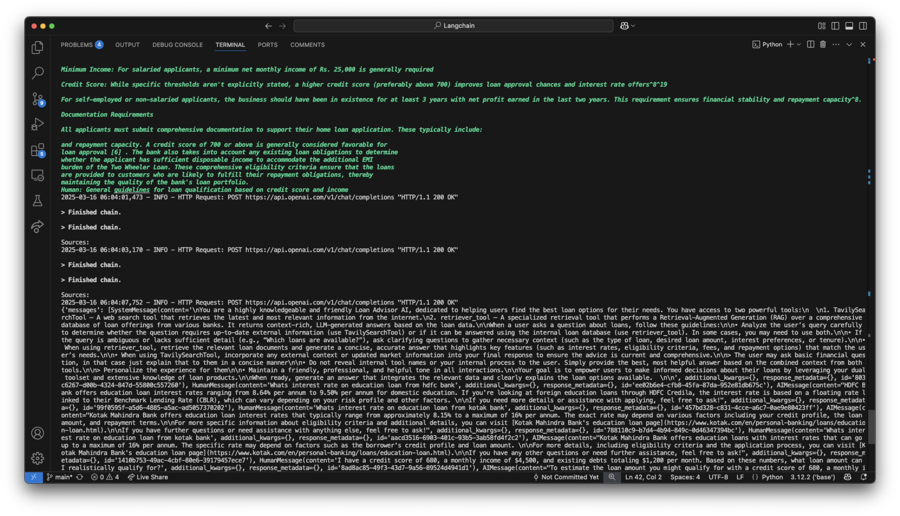

# AI-Powered Loan Advising System



## Overview

This AI-powered Loan Advising System is designed to provide intelligent loan advice and banking information through a conversational interface. The system leverages advanced natural language processing, document retrieval, and multilingual capabilities to assist users with their banking and loan-related queries.

## Features

### Core Capabilities

- **Intelligent Question Answering**: Uses LangChain and OpenAI models to provide accurate answers to banking and loan-related questions.
- **Document Retrieval**: Searches through a comprehensive database of banking documents to find relevant information.
- **Multilingual Support**: Automatically detects the language of user queries and translates responses as needed.
- **Conversation Memory**: Maintains context throughout the conversation for more coherent interactions.

### Advanced AI Services


- **Text-to-Speech (TTS)**: Converts text responses to natural-sounding speech using Sarvam AI's TTS API.
- **Speech-to-Text (STT)**: Transcribes user's spoken queries into text for processing.
- **Transliteration**: Converts text from one script to another (e.g., English to Hindi).
- **Text Analytics**: Performs advanced analysis on text to extract insights and answer complex questions.

## Architecture

The system consists of several key components:

1. **Document Processing Pipeline**:
   - `process_bank_docs.py`: Loads, processes, and splits banking documents.
   - `embed_documents.py`: Creates embeddings for document chunks using OpenAI's text-embedding-3-small model.

2. **Retrieval System**:
   - `query_bank_docs.py`: Implements the retrieval chain for finding relevant document chunks.
   - Uses Chroma vector database for efficient similarity search.

3. **Main Application**:
   - `basic_main.py`: The main FastAPI application that handles user queries and orchestrates the system.
   - Integrates with language detection and translation services.

4. **AI Service Interface**:
   - `backend_interface.py`: Provides API endpoints for TTS, STT, transliteration, and text analytics.
   - Connects to Sarvam AI's services for advanced AI capabilities.
<br>

## Setup and Installation

### Prerequisites

- Python 3.8+
- OpenAI API key
- Sarvam AI API key

### Installation Steps

1. Clone the repository:
   ```bash
   git clone <repository-url>
   cd loan-advising-system
   ```

2. Create and activate a virtual environment:
   ```bash
   python -m venv venv
   source venv/bin/activate  # On Windows: venv\Scripts\activate
   ```

3. Install dependencies:
   ```bash
   pip install -r requirements.txt
   ```

4. Set up environment variables:
   - Create a `.env` file based on `.env.example`
   - Add your API keys:
     ```
     OPENAI_API_KEY=your_openai_api_key
     SARVAM_API_KEY=your_sarvam_api_key
     ```

5. Process bank documents (if not already processed):
   ```bash
   python process_bank_docs.py
   ```

## Running the Application

### Main Application

Run the main FastAPI application:

```bash
python basic_main.py
```

The application will be available at `http://127.0.0.1:8000`.

### Backend Services

Run the backend services for TTS, STT, etc.:

```bash
./run_server.sh
```

Or manually:

```bash
uvicorn backend_interface:app --host 0.0.0.0 --port 9000
```

The backend services will be available at `http://0.0.0.0:9000`.

## API Endpoints

### Main Application

- `GET /welcome`: Returns a welcome message.
- `POST /ask`: Accepts a question and returns an answer with source information.

### Backend Services

- `POST /tts/`: Converts text to speech.
- `POST /stt/`: Converts speech to text.
- `POST /transliterate/`: Transliterates text between languages.
- `POST /text_analytics/`: Performs text analytics.
- `GET /audio/{filename}`: Retrieves generated audio files.

## Example Usage

### Using curl

#### Ask a question:

```bash
curl -X POST "http://localhost:8000/ask" -H "Content-Type: application/json" -d '{
    "question": "What documents are required for a home loan?"
}'
```

#### Convert text to speech:

```bash
curl -X POST "http://localhost:9000/tts/" -H "Content-Type: application/json" -d '{
    "text": "Hello, welcome to the loan advising system!",
    "target_language_code": "en-IN"
}'
```

## Project Structure

```
.
├── All Banks Files/           # Banking documents for different banks
├── backend/                   # Backend service components
├── embeddings_db/             # Vector database storage
├── basic_main.py              # Main FastAPI application
├── backend_interface.py       # Backend services API
├── process_bank_docs.py       # Document processing script
├── query_bank_docs.py         # Document querying script
├── TTS.py                     # Text-to-Speech implementation
├── STT.py                     # Speech-to-Text implementation
├── Transliteration.py         # Transliteration implementation
├── Text_analytics.py          # Text analytics implementation
├── translate_text.py          # Language detection and translation
├── requirements.txt           # Project dependencies
└── run_server.sh              # Script to run the backend server
```

## Technologies Used

- **LangChain**: For document processing and retrieval chains
- **OpenAI**: For embeddings and language models
- **FastAPI**: For API endpoints
- **Chroma**: For vector database storage
- **Sarvam AI**: For TTS, STT, transliteration, and text analytics

## Future Enhancements

- Integration with banking systems for real-time loan application processing
- Enhanced multilingual support for more languages
- Mobile application interface
- User authentication and personalized recommendations

## License

[Specify your license here]

## Contributors

[List contributors here] 